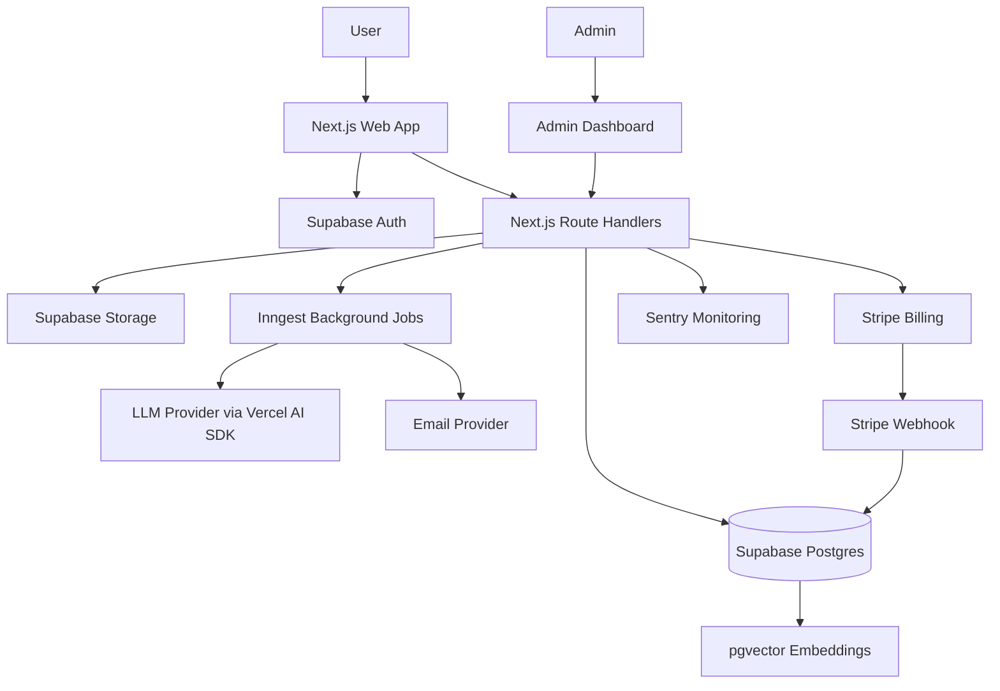

# Technical Architecture

## 1. Architecture Overview

The MVP for the AI Resume and Job Application Copilot SaaS should be built as a modular monolith using Next.js and Supabase.

A modular monolith is the right first architecture because it keeps the product easier to build, easier to deploy, and easier to operate with fewer moving parts. The application can still be organized around clear domain modules so that future service extraction remains possible if scale, team structure, or operational needs justify it.

The system should use the following recommended stack:

| Area | Choice |
|---|---|
| Frontend | Next.js App Router, TypeScript, Tailwind CSS, shadcn/ui |
| Backend | Next.js Route Handlers and Server Actions where appropriate |
| Auth | Supabase Auth |
| Database | Supabase Postgres |
| ORM | Drizzle ORM |
| Vector Search | pgvector in Supabase Postgres |
| File Storage | Supabase Storage |
| AI | Vercel AI SDK with pluggable LLM provider |
| Background Jobs | Inngest |
| Payments | Stripe |
| Monitoring | Sentry |
| Deployment | Vercel |
| CI/CD | GitHub Actions |

## 2. Main Modules

The application should be organized around the following modules:

| Module | Responsibility |
|---|---|
| Marketing site | Public pages, pricing, SEO content, conversion flows, and product positioning. |
| Authentication | Sign up, sign in, password reset, session management, and auth callbacks using Supabase Auth. |
| User onboarding | Initial profile setup, career goals, target roles, resume upload, and first-use guidance. |
| Dashboard | Authenticated home for recent resumes, applications, saved jobs, credit usage, and recommended next actions. |
| Resume builder | Structured resume editor, section management, templates, preview, export, and version-friendly resume data. |
| Resume parser | Upload handling, text extraction, structured parsing, and storage of normalized resume content. |
| AI resume tailoring | Job-aware resume optimization, keyword gap analysis, bullet improvements, ATS-style scoring, and change review. |
| AI application assistant | Cover letters, application answers, recruiter messages, and other job-specific generated materials. |
| Application tracker | Pipeline tracking, statuses, notes, reminders, contacts, interviews, and application history. |
| Job opportunities | Saved jobs, manual job entry, URL saves, admin-curated listings, and approved feed or API imports. |
| Billing and credits | Stripe checkout, subscriptions, customer portal, plan limits, credit balances, and credit refills. |
| Admin dashboard | User support views, curated job management, plan visibility, operational health, and limited moderation tools. |
| Monitoring and analytics | Product analytics events, Sentry error tracking, AI failure visibility, and operational reporting. |

## 3. Frontend Architecture

The frontend should use Next.js App Router with TypeScript. Routes should be organized with route groups to separate public marketing pages, authenticated app pages, onboarding, account settings, and admin-only surfaces.

Server Components should be used where they simplify authenticated data loading, dashboard views, list pages, preview pages, and read-heavy screens. Client Components should be used for forms, interactive resume editing, rich text or structured section editors, file uploads, drag-and-drop ordering, filters, modals, optimistic interactions, and any UI that depends on browser state.

Styling should use Tailwind CSS with shadcn/ui as the component foundation. Shared UI primitives should live in a common component layer, while domain-specific components should stay close to their module.

Suggested routes:

| Route | Purpose |
|---|---|
| `/` | Marketing homepage. |
| `/pricing` | Public pricing and plan comparison. |
| `/sign-in` | Sign in page. |
| `/sign-up` | Sign up page. |
| `/onboarding` | First-run profile, goals, and resume setup. |
| `/dashboard` | Authenticated product dashboard. |
| `/resumes` | Resume list and management. |
| `/resumes/new` | Create a new resume. |
| `/resumes/[resumeId]/edit` | Edit a resume. |
| `/resumes/[resumeId]/preview` | Preview and export a resume. |
| `/resumes/[resumeId]/tailor` | Tailor a resume for a job. |
| `/jobs` | Saved and available job opportunities. |
| `/jobs/[jobId]` | Job detail page. |
| `/applications` | Application tracker list. |
| `/applications/[applicationId]` | Application detail and timeline. |
| `/account/billing` | Billing, subscription, credits, and customer portal access. |
| `/admin` | Admin dashboard. |

Recommended route grouping:

```text
app/
  (marketing)/
  (auth)/
  (onboarding)/
  (app)/
  (admin)/
  api/
```

## 4. Backend Architecture

The backend should live inside the Next.js application using Route Handlers and Server Actions where appropriate. Route Handlers should be used for explicit API boundaries, webhooks, file operations, AI job triggers, and external integrations. Server Actions can be used for tightly coupled authenticated mutations from forms and app workflows.

All database access should happen server-side through Drizzle ORM and Supabase server clients. Client-side code should not directly perform privileged database operations.

Backend concerns should include:

- Authenticated API routes for resumes, jobs, applications, generated documents, billing state, and user settings.
- AI generation routes that validate input, check ownership, enforce credit limits, enqueue work where needed, and return structured results.
- A Stripe webhook route for subscription lifecycle events, checkout completion, payment failures, and customer portal updates.
- An Inngest webhook route for background jobs such as parsing, generation, reminders, imports, and credit refills.
- Server-side authorization checks for user-owned resources and admin-only operations.

## 5. Database Architecture

Detailed schema definitions live in [database-schema.md](database-schema.md).

Supabase Postgres should be the system of record. Drizzle ORM should define and migrate the schema. pgvector should be enabled for document embeddings and similarity search.

Main tables:

| Table | Purpose |
|---|---|
| `users` | Auth-linked user records, usually mapped from Supabase Auth identities. |
| `profiles` | User profile details, onboarding data, target roles, and preferences. |
| `subscriptions` | Stripe subscription state, plan, billing period, and credit entitlements. |
| `resumes` | Structured resume records owned by users. |
| `resume_documents` | Uploaded resume files, parsed source documents, and generated export references. |
| `jobs` | Saved jobs, manually entered jobs, admin-curated jobs, and approved imported jobs. |
| `applications` | Application tracker records connected to users, resumes, jobs, and generated documents. |
| `generated_documents` | Cover letters, tailored resumes, answers, recruiter messages, and generated artifacts. |
| `ai_generations` | AI request logs, model/provider metadata, status, token usage, cost, and credit deductions. |
| `document_embeddings` | Embeddings for resumes, jobs, and generated documents using pgvector. |

## 6. Auth Architecture

Authentication should use Supabase Auth. Dashboard, resume, job, application, billing, and admin routes should be protected.

Authorization rules:

- Users can access only their own resumes, jobs, applications, generated documents, uploads, and AI generation history.
- Admin routes require explicit admin role checks in server-side code.
- Row Level Security should be used where practical to reinforce user-owned data isolation.
- The Supabase service role key must never be exposed to the browser.
- Privileged operations using the service role key should run only on trusted server-side paths such as Route Handlers, background jobs, or webhook handlers.

## 7. AI Architecture

AI features should use the Vercel AI SDK with a provider abstraction so the application can switch or route between LLM providers without rewriting product workflows.

The AI layer should be organized around reusable prompt templates, typed input contracts, structured JSON outputs, validation, and persistent generation logs. Every AI request should create an `ai_generations` record that captures user ownership, provider, model, prompt version, status, token usage, errors, and credit impact.

Credit deduction should happen transactionally with generation creation or completion, depending on the billing policy. Failed generations should be handled consistently and should not silently consume credits unless explicitly intended.

Guardrails are required against fabricated resume content. The system should distinguish between source-backed resume facts and suggested wording. AI tailoring should improve presentation, relevance, structure, and keyword alignment without inventing employers, titles, dates, degrees, certifications, metrics, or accomplishments. User approval should be required before tailored content replaces existing resume content.

AI actions:

- Resume parsing into structured JSON.
- Job requirement extraction.
- Keyword gap analysis.
- Resume tailoring.
- Cover letter generation.
- Application answer generation.
- ATS-style scoring.

## 8. Storage Architecture

Supabase Storage should store uploaded resumes and generated files such as PDF exports, DOCX exports, parsed source files, and other user-owned artifacts.

Storage rules:

- Use private buckets for user files.
- Store files under user-owned paths, such as `users/{userId}/resumes/{resumeId}/...`.
- Use signed URLs when the browser needs temporary access to private files.
- Keep database rows as the source of truth for ownership, metadata, processing status, and relationships.
- Never expose permanent public URLs for private resume or application materials.

## 9. Payment Architecture

Stripe should manage subscriptions and payment collection.

Payment flow:

- Users select a plan and start Stripe Checkout from the billing module.
- Stripe Checkout handles payment method collection and subscription creation.
- Stripe Customer Portal lets users update payment methods, manage subscriptions, and cancel plans.
- Stripe webhooks synchronize subscription state into the local `subscriptions` table.
- The app uses the local `subscriptions` table for fast entitlement checks, plan limits, and AI credit limits.

AI credit limits should be determined by plan. Credit balances and refill rules should be enforced server-side before AI actions are started.

## 10. Background Jobs

Inngest should handle asynchronous and scheduled work.

Recommended jobs:

- Resume parsing jobs for uploaded documents.
- AI generation jobs for longer-running or retryable generation workflows.
- Reminder jobs for follow-ups, interviews, and application deadlines.
- Job import jobs for approved APIs or official feeds.
- Billing and credit refill jobs for subscription renewals and plan-based credit resets.

Background jobs should be idempotent where possible and should persist status, errors, retries, and completion timestamps.

## 11. Job Opportunities Strategy

The MVP should not use risky scraping. Job discovery should avoid violating job board terms, bypassing access controls, or depending on brittle HTML scraping.

MVP job sources:

- Manual URL save.
- Manual job form.
- Admin-curated jobs.
- Approved APIs or official feeds only.

The product can help users organize, tailor, and prepare job applications, but final job application submission should remain under user control. Users should review generated materials and decide when and where to submit applications.

## 12. Monitoring

Sentry should be used across frontend, backend, and background execution paths.

Sentry should capture:

- Frontend errors.
- API errors.
- AI failures.
- Stripe webhook failures.
- Resume parsing failures.
- Database permission errors.

Errors should include enough structured context to debug safely, such as route, module, job id, generation id, provider, and status. Sensitive resume content, generated documents, secrets, payment data, and personally sensitive application content should not be sent to monitoring systems.

## 13. Architecture Diagram


